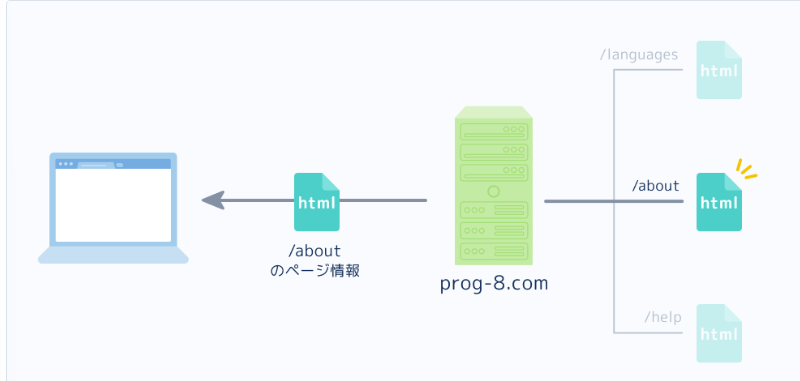

# webとは
Webとは、「インターネット上にある情報を見る仕組み」のことである。

インターネット上の情報は世界中の「サーバー」というコンピュータに保存されている。

またそれぞれの情報には、インターネット上の場所を示す「URL」が与えられている。URLは、インターネットの住所のようなものである。

そして、サーバーの情報を取得するコンピュータを「クライアント」という。

クライアントとサーバーはインターネットで繋がっており、「情報をやりとり」している。

### クライアントとサーバーの情報のやり取り

サーバとクライアント間のやりとりは、「クライアントの要求を元にサーバーが応答する」という流れになっている。

クライアントの要求を「リクエスト(request)」、サーバーの応答を「レスポンス(response)」という。

カフェで例えると、
クライアント = お客さん
サーバー = 店員さん

お客さんが注文して、店員さんがその注文に対応するという流れと同じイメージである。

リクエストをする際は、URLを用いて場所を指定する。

URLは「サーバーの場所」と「サーバーの中の情報の場所」を示している。これによって、世界中のサーバーの中から、特定のサーバーの特定の情報を取得できるようになっている。

【URLの構造】
https://prog-8.com/about

prog-8.com → サーバーの場所
about → サーバーの中の情報の場所

この場合 クライアントがprog-8.comというサーバーに「https://prog-8.com/aboutにある情報をください！」というリクエストを送る。

それに対してサーバー側(prog-8.com)は/aboutという場所を特定し、そこにある情報をレスポンスで返すという流れである。

# クライアントとサーバー

サーバーにはWebページの"HTML"が保存されている。そのHTMLを表示するクライアントを、「ブラウザ」という。

例) Google Chrome, Mozilla Firefox, Microsoft Edge, Safari
↑
何気なく使っているこいつらは、「サーバー上に保存されているHTMLを表示する。」ことをしていたのだ。

### Webページの表示の流れ

https://prog-8.com/about のページが表示される例を基に見ていく

#### ①ブラウザがサーバにリクエストを送る。

Progateの会社情報ページのURL(https://prog-8.com/about)をブラウザのアドレスバーに入力したり、Googleなどの検索サイトからProgateのリンクをクリックすることによって、「ブラウザ(クライアント)」 から「サーバ(prog-8.com)」に「リクエスト」が送られる。

#### ②サーバーがURLに応じてHTMLをブラウザに返す

#### ブラウザにHTMLが表示される。

サーバーから返ってきたHTMLがブラウザに表示される。ここで初めて、我々が見たいと思ったWebページを見ることができる。